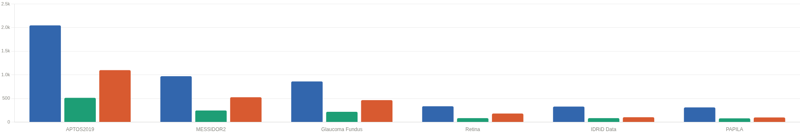
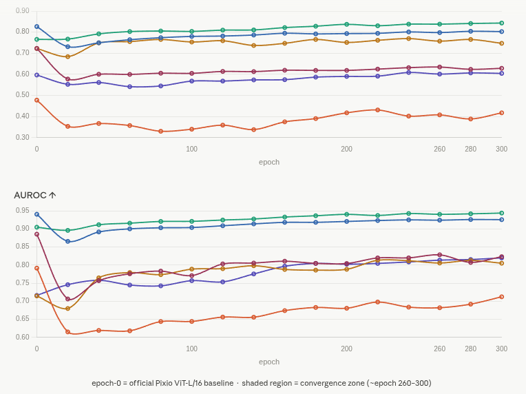
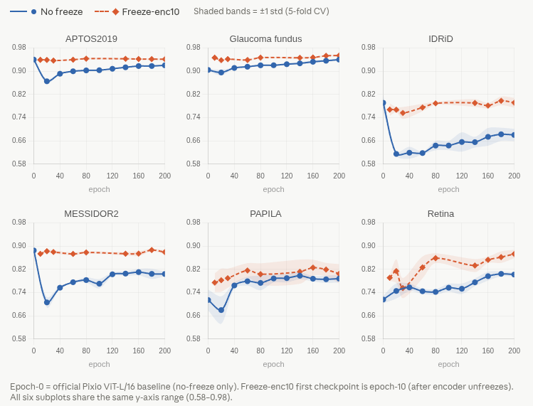
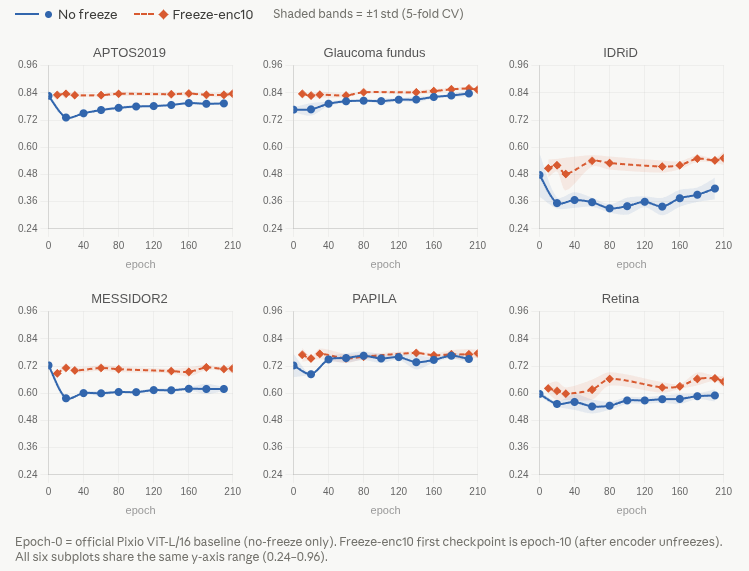

# Fundus-Pixio: Continual Pre-training of Pixio ViT-L on Fundus Eye Images

> Continual pre-training of the official [Pixio ViT-L/16](https://github.com/facebookresearch/pixio) checkpoint on a mixed fundus + natural image dataset, with downstream evaluation across 6 ophthalmic benchmarks via 5-fold cross-validation.

[](https://github.com/facebookresearch/pixio)
[]()
[]()

---

## Overview

This repository presents **continual pre-training** of the official Pixio ViT-L/16 encoder, resuming directly from the released checkpoint on a mixed dataset of fundus eye images and natural images — without any architectural modification. No task-specific decoder or domain-specific pre-training objective is introduced; the encoder is adapted using the original Pixio pre-training loss throughout. A brief encoder freeze warm-up is applied at the start of training to stabilize newly initialized components before joint optimization begins; the effect of freeze duration is examined in the [ablation study](#ablation-encoder-freeze-schedule).

Training was monitored every 20 epochs across all six downstream benchmarks. Checkpoints were evaluated throughout, and the **best-performing checkpoint per dataset was selected based on validation AUROC**, following standard checkpoint-selection practice. Across most datasets, performance plateaus or begins to oscillate after epoch ~260–300, indicating convergence; we therefore report results up to epoch 300.

Downstream evaluation uses **5-fold cross-validation**, reporting **Accuracy** and **AUROC** across 6 publicly available fundus datasets.

---

## Setup

This codebase is built on top of the [Pixio](https://github.com/facebookresearch/pixio) pre-training framework.

```bash
conda create -n fundus-pixio python=3.10
conda activate fundus-pixio
pip install -r requirements.txt
```

**Hardware:** 2× NVIDIA A6000 GPUs

---

## Pre-training

### Data

We use a mixed dataset of fundus eye images and natural images for pre-training. Natural images are drawn from ImageNet-1K. Fundus images are clinical retinal photographs provided by **Chang Gung Memorial Hospital (CGMH), Taiwan**, used under an institutional data-sharing agreement for research purposes. We sincerely thank CGMH for providing access to these clinical data.

> **IRB approval:** *(IRB No. — please fill in)*

### Launch Pre-training

```bash
cd pretraining

# Resume continual pre-training from official Pixio ViT-L/16 checkpoint
bash scripts/pretrain_fundus_vitl16.sh
```

### Resume from Pixio ViT-L Official Checkpoint

```bash
--resume /path/to/pixio_vitl16.pth \
--model pixio_vit_large_patch16
```

---

## Evaluation

Downstream evaluation is performed by loading each saved checkpoint and running **5-fold cross-validation** on classification tasks. We report mean ± std across folds.

### Datasets

The following 6 publicly available fundus benchmarks are used for downstream evaluation. Dataset splits follow the original papers or standard community splits.

| Dataset | Task | Classes | Train | Val | Test |
|---|---|---|---|---|---|
| [APTOS2019](https://www.kaggle.com/c/aptos2019-blindness-detection) | Diabetic Retinopathy Grading | 5 | 2,048 | 514 | 1,100 |
| [MESSIDOR2](https://www.adcis.net/en/third-party/messidor2/) | Diabetic Retinopathy Grading | 5 | 972 | 246 | 526 |
| [Glaucoma_fundus](https://dataverse.harvard.edu/dataset.xhtml?persistentId=doi:10.7910/DVN/1YRRAC) | Glaucoma Detection | 3 | 861 | 218 | 465 |
| [Retina](https://www.kaggle.com/datasets/jr2ngb/cataractdataset) | Diabetic Retinopathy Grading | 4 | 336 | 84 | 181 |
| [IDRiD](https://ieee-dataport.org/open-access/indian-diabetic-retinopathy-image-dataset-idrid) | Diabetic Retinopathy Grading | 5 | 329 | 84 | 103 |
| [PAPILA](https://figshare.com/articles/dataset/PAPILA/14798004) | Glaucoma Detection | 3 | 311 | 79 | 98 |


<!-- Replace with your exported grouped bar chart (Train / Val / Test per dataset). -->

### Launch Evaluation

```bash
bash scripts/eval_fivefold_cv.sh
```

---

## Results

All results are mean ± std over 5-fold cross-validation. `epoch-0` corresponds to the **official Pixio ViT-L/16 checkpoint** before any continual pre-training (baseline). Checkpoints are evaluated every 20 epochs and reported up to epoch 300, where performance has converged across all six datasets. The **best checkpoint per dataset** is selected based on validation AUROC and highlighted in bold.

### Continual Pre-training Experimental Results


<!-- Replace with your exported figure (Accuracy + AUROC vs. epoch 0–300, 6 datasets). -->

### Summary table — representative checkpoints

#### Accuracy ↑

| Checkpoint | APTOS2019 | Glaucoma\_fundus | IDRiD | MESSIDOR2 | PAPILA | Retina |
|---|---|---|---|---|---|---|
| epoch-0 (baseline) | 0.8264 ± 0.0065 | 0.7656 ± 0.0105 | 0.4777 ± 0.0957 | 0.7228 ± 0.0094 | 0.7224 ± 0.0517 | 0.5967 ± 0.0110 |
| epoch-100 | 0.7796 ± 0.0062 | 0.8034 ± 0.0119 | 0.3398 ± 0.0376 | 0.6046 ± 0.0055 | 0.7531 ± 0.0196 | 0.5680 ± 0.0153 |
| epoch-200 | 0.7931 ± 0.0025 | 0.8370 ± 0.0113 | 0.4175 ± 0.0476 | 0.6186 ± 0.0084 | 0.7510 ± 0.0137 | 0.5901 ± 0.0269 |
| epoch-280 | 0.8040 ± 0.0021 | 0.8409 ± 0.0104 | 0.3883 ± 0.0633 | 0.6236 ± 0.0144 | 0.7653 ± 0.0204 | 0.6066 ± 0.0386 |
| epoch-300 | **0.8025 ± 0.0071** | **0.8430 ± 0.0015** | 0.4175 ± 0.0743 | 0.6285 ± 0.0167 | 0.7469 ± 0.0610 | 0.6044 ± 0.0333 |

> **Bold** = best result per dataset among representative checkpoints. Peak accuracy across all evaluated epochs: IDRiD at epoch-220 (0.4311), MESSIDOR2 at epoch-260 (0.6346), PAPILA at epoch-80/180/280 (0.7653), Retina at epoch-240 (0.6088). See full results below.

#### AUROC ↑

| Checkpoint | APTOS2019 | Glaucoma\_fundus | IDRiD | MESSIDOR2 | PAPILA | Retina |
|---|---|---|---|---|---|---|
| epoch-0 (baseline) | 0.9403 ± 0.0022 | 0.9046 ± 0.0035 | 0.7914 ± 0.0265 | 0.8853 ± 0.0055 | 0.7145 ± 0.0360 | 0.7161 ± 0.0128 |
| epoch-100 | 0.9037 ± 0.0003 | 0.9208 ± 0.0024 | 0.6440 ± 0.0159 | 0.7707 ± 0.0161 | 0.7887 ± 0.0138 | 0.7569 ± 0.0139 |
| epoch-200 | 0.9205 ± 0.0010 | 0.9402 ± 0.0044 | 0.6805 ± 0.0211 | 0.8042 ± 0.0078 | 0.7882 ± 0.0130 | 0.8022 ± 0.0064 |
| **epoch-280 (best APTOS, PAPILA)** | **0.9258 ± 0.0019** | 0.9416 ± 0.0047 | 0.6918 ± 0.0153 | 0.8072 ± 0.0309 | **0.8128 ± 0.0247** | 0.8153 ± 0.0135 |
| **epoch-300 (best 4/6)** | 0.9255 ± 0.0011 | **0.9437 ± 0.0038** | **0.7122 ± 0.0247** | **0.8231 ± 0.0141** | 0.8050 ± 0.0198 | **0.8197 ± 0.0115** |

> **Bold** = best result per dataset. AUROC on APTOS2019 and PAPILA peaks at epoch-280; epoch-300 achieves peak AUROC on the remaining four datasets (Glaucoma\_fundus, IDRiD, MESSIDOR2, Retina).

<details>
<summary>Full results — all checkpoints (every 20 epochs, epoch 0–300)</summary>

#### Accuracy ↑ (full)

| Checkpoint | APTOS2019 | Glaucoma\_fundus | IDRiD | MESSIDOR2 | PAPILA | Retina |
|---|---|---|---|---|---|---|
| epoch-0 | 0.8264 ± 0.0065 | 0.7656 ± 0.0105 | 0.4777 ± 0.0957 | 0.7228 ± 0.0094 | 0.7224 ± 0.0517 | 0.5967 ± 0.0110 |
| epoch-20 | 0.7309 ± 0.0053 | 0.7669 ± 0.0276 | 0.3534 ± 0.0244 | 0.5776 ± 0.0049 | 0.6837 ± 0.0000 | 0.5525 ± 0.0111 |
| epoch-40 | 0.7495 ± 0.0029 | 0.7918 ± 0.0098 | 0.3670 ± 0.0346 | 0.6004 ± 0.0058 | 0.7490 ± 0.0116 | 0.5613 ± 0.0349 |
| epoch-60 | 0.7640 ± 0.0061 | 0.8026 ± 0.0074 | 0.3573 ± 0.0199 | 0.5996 ± 0.0109 | 0.7551 ± 0.0204 | 0.5414 ± 0.0310 |
| epoch-80 | 0.7736 ± 0.0070 | 0.8052 ± 0.0019 | 0.3301 ± 0.0182 | 0.6053 ± 0.0032 | 0.7653 ± 0.0191 | 0.5448 ± 0.0177 |
| epoch-100 | 0.7796 ± 0.0062 | 0.8034 ± 0.0119 | 0.3398 ± 0.0376 | 0.6046 ± 0.0055 | 0.7531 ± 0.0196 | 0.5680 ± 0.0153 |
| epoch-120 | 0.7815 ± 0.0031 | 0.8095 ± 0.0062 | 0.3592 ± 0.0238 | 0.6137 ± 0.0078 | 0.7592 ± 0.0116 | 0.5680 ± 0.0143 |
| epoch-140 | 0.7862 ± 0.0031 | 0.8103 ± 0.0133 | 0.3379 ± 0.0385 | 0.6129 ± 0.0087 | 0.7367 ± 0.0318 | 0.5735 ± 0.0163 |
| epoch-160 | 0.7947 ± 0.0051 | 0.8215 ± 0.0050 | 0.3748 ± 0.0374 | 0.6194 ± 0.0074 | 0.7469 ± 0.0112 | 0.5746 ± 0.0224 |
| epoch-180 | 0.7915 ± 0.0049 | 0.8280 ± 0.0086 | 0.3903 ± 0.0318 | 0.6186 ± 0.0230 | 0.7653 ± 0.0125 | 0.5867 ± 0.0126 |
| epoch-200 | 0.7931 ± 0.0025 | 0.8370 ± 0.0113 | 0.4175 ± 0.0476 | 0.6186 ± 0.0084 | 0.7510 ± 0.0137 | 0.5901 ± 0.0269 |
| epoch-220 | 0.7942 ± 0.0045 | 0.8301 ± 0.0103 | 0.4311 ± 0.0569 | 0.6247 ± 0.0099 | 0.7612 ± 0.0155 | 0.5912 ± 0.0231 |
| epoch-240 | 0.8009 ± 0.0066 | 0.8378 ± 0.0154 | 0.4019 ± 0.0483 | 0.6316 ± 0.0084 | 0.7694 ± 0.0155 | 0.6088 ± 0.0311 |
| epoch-260 | 0.7978 ± 0.0078 | 0.8378 ± 0.0089 | 0.4078 ± 0.0363 | 0.6346 ± 0.0105 | 0.7571 ± 0.0371 | 0.6011 ± 0.0318 |
| epoch-280 | 0.8040 ± 0.0021 | 0.8409 ± 0.0104 | 0.3883 ± 0.0633 | 0.6236 ± 0.0144 | 0.7653 ± 0.0204 | 0.6066 ± 0.0386 |
| epoch-300 | **0.8025 ± 0.0071** | **0.8430 ± 0.0015** | **0.4175 ± 0.0743** | **0.6285 ± 0.0167** | 0.7469 ± 0.0610 | **0.6044 ± 0.0333** |

#### AUROC ↑ (full)

| Checkpoint | APTOS2019 | Glaucoma\_fundus | IDRiD | MESSIDOR2 | PAPILA | Retina |
|---|---|---|---|---|---|---|
| epoch-0 | 0.9403 ± 0.0022 | 0.9046 ± 0.0035 | 0.7914 ± 0.0265 | 0.8853 ± 0.0055 | 0.7145 ± 0.0360 | 0.7161 ± 0.0128 |
| epoch-20 | 0.8655 ± 0.0069 | 0.8958 ± 0.0098 | 0.6151 ± 0.0073 | 0.7062 ± 0.0180 | 0.6798 ± 0.0473 | 0.7457 ± 0.0262 |
| epoch-40 | 0.8915 ± 0.0027 | 0.9115 ± 0.0021 | 0.6192 ± 0.0206 | 0.7569 ± 0.0051 | 0.7646 ± 0.0100 | 0.7579 ± 0.0130 |
| epoch-60 | 0.9000 ± 0.0017 | 0.9157 ± 0.0029 | 0.6181 ± 0.0047 | 0.7758 ± 0.0028 | 0.7792 ± 0.0154 | 0.7447 ± 0.0093 |
| epoch-80 | 0.9030 ± 0.0017 | 0.9205 ± 0.0032 | 0.6438 ± 0.0161 | 0.7832 ± 0.0092 | 0.7734 ± 0.0253 | 0.7424 ± 0.0093 |
| epoch-100 | 0.9037 ± 0.0003 | 0.9208 ± 0.0024 | 0.6440 ± 0.0159 | 0.7707 ± 0.0161 | 0.7887 ± 0.0138 | 0.7569 ± 0.0139 |
| epoch-120 | 0.9086 ± 0.0006 | 0.9244 ± 0.0035 | 0.6562 ± 0.0333 | 0.8031 ± 0.0062 | 0.7899 ± 0.0146 | 0.7533 ± 0.0181 |
| epoch-140 | 0.9137 ± 0.0004 | 0.9273 ± 0.0040 | 0.6557 ± 0.0184 | 0.8055 ± 0.0079 | 0.7981 ± 0.0124 | 0.7754 ± 0.0136 |
| epoch-160 | 0.9180 ± 0.0009 | 0.9327 ± 0.0048 | 0.6740 ± 0.0306 | 0.8106 ± 0.0111 | 0.7878 ± 0.0096 | 0.7966 ± 0.0154 |
| epoch-180 | 0.9181 ± 0.0033 | 0.9363 ± 0.0034 | 0.6828 ± 0.0226 | 0.8046 ± 0.0176 | 0.7859 ± 0.0128 | 0.8046 ± 0.0083 |
| epoch-200 | 0.9205 ± 0.0010 | 0.9402 ± 0.0044 | 0.6805 ± 0.0211 | 0.8042 ± 0.0078 | 0.7882 ± 0.0130 | 0.8022 ± 0.0064 |
| epoch-220 | 0.9230 ± 0.0022 | 0.9370 ± 0.0059 | 0.6978 ± 0.0187 | 0.8197 ± 0.0087 | 0.8133 ± 0.0311 | 0.8045 ± 0.0157 |
| epoch-240 | 0.9249 ± 0.0025 | 0.9424 ± 0.0034 | 0.6836 ± 0.0167 | 0.8198 ± 0.0110 | 0.8118 ± 0.0128 | 0.8085 ± 0.0109 |
| epoch-260 | 0.9240 ± 0.0019 | 0.9402 ± 0.0033 | 0.6819 ± 0.0232 | 0.8283 ± 0.0083 | 0.8055 ± 0.0174 | 0.8135 ± 0.0165 |
| epoch-280 | **0.9258 ± 0.0019** | 0.9416 ± 0.0047 | 0.6918 ± 0.0153 | 0.8072 ± 0.0309 | **0.8128 ± 0.0247** | 0.8153 ± 0.0135 |
| epoch-300 | 0.9255 ± 0.0011 | **0.9437 ± 0.0038** | **0.7122 ± 0.0247** | **0.8231 ± 0.0141** | 0.8050 ± 0.0198 | **0.8197 ± 0.0115** |

</details>

---

## Key Observations

- **Early epochs (0–60):** A temporary performance drop is observed across most datasets, typical during domain adaptation of a general-purpose pre-trained encoder toward fundus-specific features.
- **Steady improvement (epochs 60–260):** Performance improves consistently across all six datasets. AUROC gains are particularly pronounced on IDRiD (+6.8 pp absolute over baseline) and Retina (+10.4 pp absolute over baseline) by epoch 260.
- **Convergence (~epoch 260–300):** Metrics plateau or oscillate across datasets, indicating the model has converged. We select the best checkpoint per dataset based on validation AUROC within this range, rather than using the final epoch.
- **Best checkpoints:** epoch-280 achieves peak AUROC on APTOS2019; epoch-300 achieves peak or near-peak AUROC on the remaining five datasets and is recommended as the general-purpose checkpoint.

---

## Ablation: Encoder Freeze Warm-up

As described in the overview, we freeze the encoder for a short warm-up period at the start of continual pre-training. This is not a staged training strategy — the model architecture and training objective remain unchanged throughout; only the encoder's gradient updates are temporarily disabled. The motivation is straightforward: when resuming from a strong pre-trained checkpoint, allowing immediate unconstrained updates to all parameters can destabilize the encoder before other components have had any time to adapt. A brief freeze gives the rest of the model a chance to reach a stable initialization, after which full joint training proceeds normally.

This ablation compares **no-freeze** (encoder updated from epoch 0) against **freeze-enc10** (encoder frozen for the first 10 epochs, then jointly optimized), evaluated on all six downstream benchmarks up to epoch 200 using 5-fold cross-validation AUROC.

### Comparison

#### AUROC ↑


<!-- Replace with your exported figure: AUROC vs epoch (0–200), no-freeze (blue solid) vs freeze-enc10 (coral dashed), 6 subplots with unified y-axis (0.58–0.98). -->

#### Accuracy ↑


<!-- Replace with your exported figure: Accuracy vs epoch (0–200), no-freeze (blue solid) vs freeze-enc10 (coral dashed), 6 subplots with unified y-axis (0.24–0.96). -->

### Key Findings

- **No-freeze collapses early.** Without a freeze warm-up, both AUROC and accuracy drop sharply in the first 20–40 epochs before recovering. The collapse is most severe on IDRiD (AUROC: 0.791 → 0.615; accuracy: 0.478 → 0.330) and MESSIDOR2 (AUROC: 0.885 → 0.706; accuracy: 0.723 → 0.578).
- **Freeze-enc10 avoids the collapse entirely.** The first checkpoint after encoder release (epoch-10) already achieves competitive performance across all six datasets — no recovery phase needed.
- **Freeze-enc10 leads at epoch 200 across all datasets.** AUROC gains over no-freeze are largest on Retina (+7.1 pp; 0.873 vs 0.802) and IDRiD (+11.1 pp; 0.792 vs 0.681); accuracy gains are largest on IDRiD (+12.4 pp; 0.542 vs 0.417) and MESSIDOR2 (+8.8 pp; 0.706 vs 0.619).
- **The overhead is negligible.** A 10-epoch freeze adds minimal cost to a 200-epoch run and is the recommended default when starting continual pre-training from the Pixio checkpoint.

---

## Pretrained Checkpoints

| Checkpoint | Trained Epochs | Notes |
|---|---|---|
| `epoch-0.pth` | 0 | Official Pixio ViT-L/16 (baseline) |
| `epoch-100.pth` | 100 | Early training |
| `epoch-200.pth` | 200 | Mid training |
| `epoch-280.pth` | 280 | Best AUROC on APTOS2019 and PAPILA |
| `epoch-300.pth` | 300 | Best AUROC on 4/6 datasets (Glaucoma\_fundus, IDRiD, MESSIDOR2, Retina) — **recommended** |

> TODO: add download links (HuggingFace / Google Drive) once uploaded.

---

## Citation

If you use this work, please cite the original Pixio paper:

```bibtex
@article{pixio,
  title={In Pursuit of Pixel Supervision for Visual Pre-training},
  author={Yang, Lihe and Li, Shang-Wen and Li, Yang and Lei, Xinjie and Wang, Dong and Mohamed, Abdelrahman and Zhao, Hengshuang and Xu, Hu},
  journal={arXiv:2512.15715},
  year={2025}
}
```

---

## Acknowledgement

This work builds directly on [Pixio](https://github.com/facebookresearch/pixio) (Facebook Research). We sincerely thank the original authors for open-sourcing their codebase and pre-trained models.
